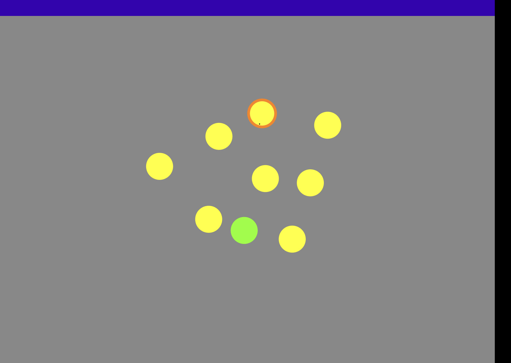

# Surface Duo Pen as a Multi-Input Device
  
With its dual screens and versatile stylus, the Surface Duo offers new opportunities for both user interface and user interaction with applications. This blog post will examine how we at Mark/Space integrated Duo support into our Argon retro gaming system, and present a step-by-step tutorial to add support for the Surface Duo Pen into your own application.
 
Traditional Android XML UI layouts have become complicated due to the large number of device form factors from small phones to large tablets, notebooks and TVs. Introducing support for foldable devices that can be configured and held in multiple orientations was greatly simplified by migrating our user interface to Jetpack Compose. Compose allows the developer to describe the components that make up the UI in code, and let the runtime manage the correct display for the current device and orientation.
  
Switching to Compose also allowed us to work with multiple user input methods more easily. One of Argon's main design goals is to bring the retro gaming experience onto modern hardware, with easy installation and no difficult configuration. We try to take advantage of the advances in hardware to enhance the game playing experience, and breathe new life into retro games.
 
An example of this is the Atari 8-bit game Planetary Defense, by Tom Hudson. The game was originally played with an analog joystick or a KoalaPad graphics tablet. We added support for pen input to aim and fire in the game. The same Compose event handling also works for touch and mouse input, so there is really very little to do to add a large amount of functionality.
 
[Planetary Defense Movie]({}assets/planetary_defense_duo.mp4)

You can try out Argon yourself by visiting [www.playargon.com](https://www.playargon.com). Android, AndroidTV and Chrome OS devices are currently supported.
  
</br>
</br>

# Tutorial
 
DotWorld is a simple Android app that draws and a manages collection of colored dots on a drawing surface, with a completely pen driven user interface. We will add code to use the pen to create, select, move, color and delete dots.
 
This example uses Jetpack Compose to present and manage the all of the UI, so some experience with Kotlin and Compose will be helpful. Check the references at the end of this article if you need help getting started with these technologies.
 

 
### Setup
Download the tutorial starter project from [Mark/Space github](https://github.com/markspaceinc/dot-world) repository. This Android Studio project contains the boilerplate Compose setup code, and the code that draws the dots, so we can concentrate on handling events from the pen.
 
The repository also contains the completed project, ready to run.
 
The app's drawing surface is a Compose canvas. Every time the UI refreshes, the drawing code iterates the list of dots. This is done in reverse order to keep the most recently created dots toward the front of the Z-order. It also checks to see if a dot is selected, and draws an outline around it, if so.
   
Pen support is still evolving, so we are using the still experimental pointerInteropFilter API to enable better pen support. This API gives us access to the underlying Motion events from the UI, and peovides additional stylus information such as whether it is hovering over the screen, and how hard it is being pressed on a tap.
 
The following steps wire up events using the Canvas' Compose Modifier. We do this by overriding the pointerInteropFilter function to specify the behavior we want on various events.
 
All of the code for this app is in the MainActivity.kt file. The DrawDots() function is where the pen (and other) event handling is implemented. The pointerInteropFilter in the sample code already captures the MotionEvent parameter, and has a skeleton when {} block with cases for the events we need to process. As you complete this tutorial, you will be adding the handling code necessary to manage the objects on screen.

Note that you will need Android Studio Chipmunk or later to get support for the required APIs.

### 1. Tap
 
Taps from the pen are handled in the same way as touch events, with the advantage of pen taps being much more precise. 
 
Add this code to the .pointerInteropFilter function override on the Canvas' modifier to add dots to the array, and select them.
 
Replacement ACTION_DOWN code block:
 
```
MotionEvent.ACTION_DOWN -> {
    var newSelectedDot = dotManager.findDotAt(dots, motionEvent.x, motionEvent.y)
    if (newSelectedDot != null) {
        // Eraser handling
        if(selectedDot != null) {
            if (!selectedDot!!.isEqual(newSelectedDot)) {
                selectedDot?.selected = false
                selectedDot = newSelectedDot
                selectedDot?.selected = true
            }

            logText = "TAP SELECT at ${motionEvent.x}, ${motionEvent.y}"
        }
    } else {
        selectedDot?.selected = false
        selectedDot = Dot(motionEvent.x, motionEvent.y, 50.0F)
        dots.add(selectedDot!!)
        selectedDot?.selected = true

        logText = "TAP ADD at ${motionEvent.x}, ${motionEvent.y}"
    }
    
    penDown = true
    lastPenX = motionEvent.x
    lastPenY = motionEvent.y
}
```
 
Note that we're also setting a flag when the pan is touching the screen. We need to add matching code to the ACTION_UP case to clear the flag as well. This is important to handle dragging in the next step.
 
Replacement ACTION_UP code block:
 
```
MotionEvent.ACTION_UP -> {
   logText = "UP at ${motionEvent.x}, ${motionEvent.y}"
   penDown = false
}
 
```
 
Run the app now. At this point, you can tap into the background to create a dot, or on a dot to select it.
 
### 2. Drag
 
While the pen is down, we track ACTION_MOVE events to implement dragging.
 
Replacement ACTION_MOVE code block:
 
```
MotionEvent.ACTION_MOVE -> {
   if (penDown && selectedDot != null) {
       var deltaX = motionEvent.x - lastPenX
       var deltaY = motionEvent.y - lastPenY
       selectedDot.x += deltaX
       selectedDot.y += deltaY
       lastPenX = motionEvent.x
       lastPenY = motionEvent.y
 
       logText = "MOVE to ${motionEvent.x}, ${motionEvent.y}"
   }
}
```
 
Now, tapping on a dot selects it, and it will move with the pen until an ACTION_UP is received.
 
### 3. Hover
 
We want to update the cursor whenever the pen starts hovering over the drawing view, so we handle the ACTION_HOVER_ENTER event. We want the cursor to normally be crosshairs.
 
Replacement ACTION_HOVER_ENTER code block:
```
MotionEvent.ACTION_HOVER_ENTER -> {
    penHovering = true
    logText = "HOVER_ENTER"
}
```
 
REplacement ACTION_HOVER_MOVE code block:

```
MotionEvent.ACTION_HOVER_MOVE -> {
    lastPenX = motionEvent.x
    lastPenY = motionEvent.y
    logText = "HOVER_MOVE"
}
```
 
Replacement ACTION_HOVER_EXIT code block:
```
MotionEvent.ACTION_HOVER_EXIT -> {
    penHovering = false
    logText = "HOVER_EXIT"
}
```

### 4. Pen button
 
To use the pen's side button, we check the MotionEvent's buttonState before processing the ACTION_DOWN event. If the button is pressed when a dot is tapped, it changes color.
 
Replacement ACTION_DOWN code block:
```
MotionEvent.ACTION_DOWN -> {
    var newSelectedDot = dotManager.findDotAt(dots, motionEvent.x, motionEvent.y)
    if (newSelectedDot != null) {
        if(selectedDot != null) {
            if (!selectedDot!!.isEqual(newSelectedDot)) {
                selectedDot?.selected = false
                selectedDot = newSelectedDot
                selectedDot?.selected = true
            }

            logText = "TAP SELECT at ${motionEvent.x}, ${motionEvent.y}"
        }
    } else {
        selectedDot?.selected = false
        selectedDot = Dot(motionEvent.x, motionEvent.y, 50.0F)
        dots.add(selectedDot!!)
        selectedDot?.selected = true

        logText = "TAP ADD at ${motionEvent.x}, ${motionEvent.y}"
    }

    if (selectedDot != null) {
        if (buttonState != 0) {
            selectedDot!!.color = abs(selectedDot!!.color - 1)
        }
    }

    penDown = true
    lastPenX = motionEvent.x
    lastPenY = motionEvent.y
}
```
 
### 5. Eraser
 
So far, we have been treating any interaction source the same way - the code handles touches, pen taps and even mouse clicks the same way. In order to use the eraser properly, we need to call MotionEvent.getToolType() to get more information about the source. The sample project already includes this code.
 
We want our cursor to normally be crosshhairs, but change to an eraser when the pen is inverted, so the ACTION_DOWN handler needs to be updated. To check the tooltype in use.

Replacement ACTION_DOWN code block:

```
MotionEvent.ACTION_DOWN -> {
    var newSelectedDot = dotManager.findDotAt(dots, motionEvent.x, motionEvent.y)
    if (newSelectedDot != null) {
        // Eraser handling
        if (toolType == TOOL_TYPE_ERASER) {
            dots.remove(newSelectedDot)

            logText = "ERASE at ${motionEvent.x}, ${motionEvent.y}"
        }
            if(selectedDot != null) {
                if (!selectedDot!!.isEqual(newSelectedDot)) {
                    selectedDot?.selected = false
                    selectedDot = newSelectedDot
                    selectedDot?.selected = true
            }

            logText = "TAP SELECT at ${motionEvent.x}, ${motionEvent.y}"
        }
    } else {
        if (toolType != TOOL_TYPE_ERASER) {
            selectedDot?.selected = false
            selectedDot = Dot(motionEvent.x, motionEvent.y, 50.0F)
            dots.add(selectedDot!!)
            selectedDot?.selected = true

            logText = "TAP ADD at ${motionEvent.x}, ${motionEvent.y}"
        }
    }

    if (selectedDot != null) {
        if (buttonState != 0) {
            selectedDot!!.color = abs(selectedDot!!.color - 1)
        }
    }

    penDown = true
    lastPenX = motionEvent.x
    lastPenY = motionEvent.y
}
```
 
 
## Resources.
 
[Jetpack Compose](https://developer.android.com/jetpack/compose)
 
[Get Started with Kotlin](https://kotlinlang.org/docs/getting-started.html)
 

